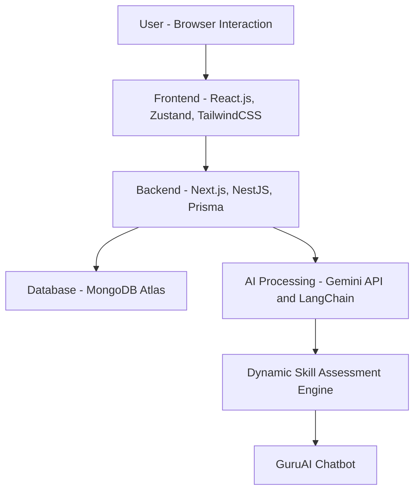

# PadhAI - Personalized Aptitude Development Helper

An AI-Powered Self-Learning Assessment Platform built to revolutionize how users learn, assess themselves, and grow in the digital era.

---

## 🚀 About The Project

In today’s world of digital overload and shrinking attention spans, traditional education methods fail to keep learners engaged.  
PadhAI solves this by delivering personalized learning roadmaps, real-time skill gap analysis, and an AI mentor chatbot — all gamified to boost motivation.

This project uses *Next.js, **TypeScript, **TailwindCSS, **Prisma, and integrates **Gemini API* for intelligent learning experiences.

---

## 🧠 Problem Statement

- Students are overwhelmed by social media and multitasking, leading to reduced focus, poor retention, and rising cognitive decline.
- Post-pandemic, mental health issues (anxiety, ADHD) have surged, severely impacting learning productivity.
- Traditional static learning methods can no longer maintain user attention or adapt to individual needs.
- There is an urgent need for an engaging, adaptive, tech-driven solution to empower self-learning.

---

## 🎯 Solution Overview

*PadhAI* offers:
- Dynamic, AI-generated skill gap assessments and personalized learning roadmaps.
- AI mentor chatbot (*GuruAI*) that resolves queries 24x7 and recommends trusted resources.
- Gamified learning: earn XP, badges, and milestone rewards.
- Cross-device access (web, mobile, tablet) with real-time progress syncing.
- Scientifically proven learning techniques (Pomodoro, Active Recall) built into the flow.

PadhAI transforms boring learning into a quest for self-mastery.

---

## 🏛 Architecture

